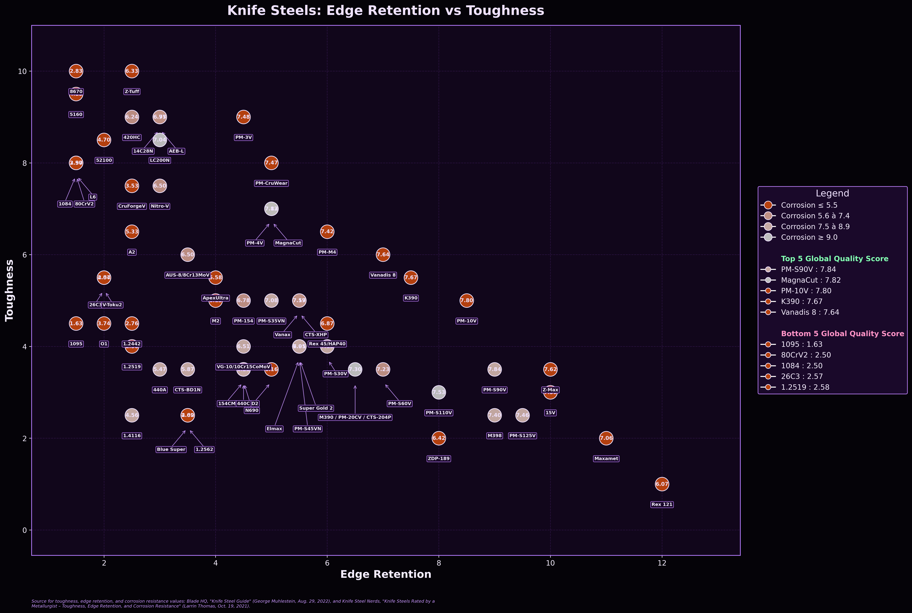

# Knife Steel Properties ML Analysis

Python project for predicting knife-steel properties, collecting retail knife
prices, and generating comparative tables and visualizations.

## Features

- Predicts toughness, edge retention, and corrosion resistance from chemical
  composition and production method.
- Evaluates several regression models using cross-validation.
- Collects knife prices from Blade HQ, KnifeCenter, and Blades Canada.
- Generates tables and figures comparing observed and predicted steels.

## Main Scripts

- `src/predict_steel_properties.py`: trains the models and predicts steel properties.
- `src/scrape_bladehq.py`: collects prices from Blade HQ.
- `src/scrape_knifecenter.py`: collects prices from KnifeCenter.
- `src/scrape_bladescanada.py`: collects prices from Blades Canada.
- `src/main.py`: generates the final tables and visualizations.

## Installation

```powershell
git clone https://github.com/ludcaso5/Knife-steel-properties-ML-analysis.git
cd Knife-steel-properties-ML-analysis

python -m venv .venv
.\.venv\Scripts\Activate.ps1

python -m pip install --upgrade pip
python -m pip install -r requirements.txt
python -m playwright install chromium
```

## Usage

Price collection is optional:

```powershell
python src/scrape_bladehq.py
python src/scrape_knifecenter.py
python src/scrape_bladescanada.py
```

Run the prediction model:

```powershell
python src/predict_steel_properties.py
```

Generate the final results:

```powershell
python src/main.py
```

## Example Outputs



## Data Sources

Steel-property ratings are primarily based on Knife Steel Nerds and the Blade
HQ Knife Steel Guide.

Retail prices are collected from publicly accessible product pages on Blade HQ,
KnifeCenter, and Blades Canada.

See [`data/README.md`](data/README.md) for additional information.

## Limitations

Predicted ratings are model estimates, not laboratory measurements. Actual knife
performance also depends on heat treatment, hardness, blade geometry, and
manufacturing quality.

Retail prices represent complete knives and are influenced by factors beyond
steel performance.

## License

The original source code is licensed under the MIT License. Third-party data
remain subject to the terms of their original sources.

## Author

**Ludwig Casaubon**  
M.Sc. Candidate in Financial Engineering, HEC Montréal
